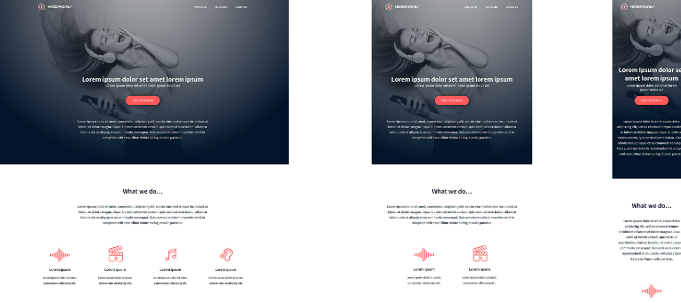

# The Ground-Up Project ⏳

### What is this about?🤷🏽‍♂️
This project aims to help the learner employ what they have learnt so far.  
The learner will use the HTML and CSS code learnt to recreate this beautiful webpage, in a desktop, tablet and mobile form-factor;  
  
The key concepts needed to achieve this are:  
- Intermediate HTML
- Intermideate CSS  
  - Flexbox
  - Box-Model  
- **Creativity🤔**  

Some areas I have really enjoyed working on are the *hover* and *active* states of a button.  
You can really get crazy with properties like;  
  - Stretch 
  - Opacity
  - Shadow etc.  

This project will solidify the concepts learnt by the learner through application.  
Nothing beats **Learning by Implementation**, so let's get typing!⌨️

My completed responsive page can be previewed <a href="https://htmlpreview.github.io/?https://github.com/josephchigiz/headphones/blob/master/4-index.html">here</a>.

**Happy Coding!🫡**